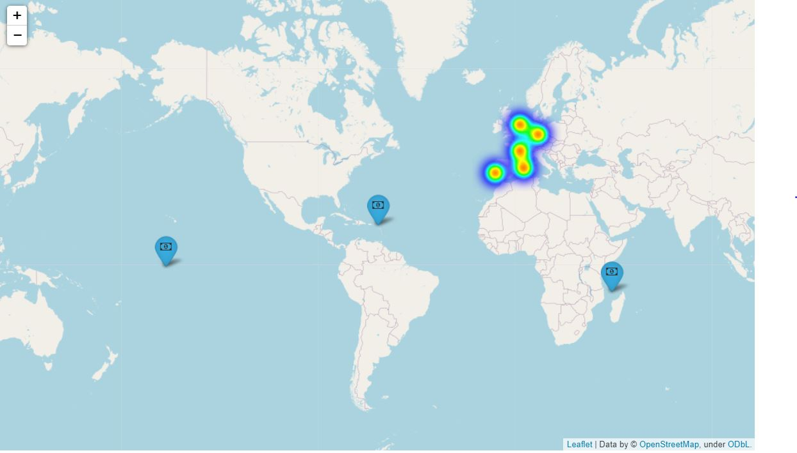

Portugal has always been a very visited country, not only by its neighboring countries, but also by tourists from all over the world. 
We propose the study, analysis and conclusions on the reservation of accommodation in two main points of Portugal, Lisbon and Algarve. In addition, we offer a price search engine so that you can know month by month and based on different parameters, how much the night would cost in each of these areas.

# STUDY AND ANALYSIS
For the first part of our project, we have relied on a Kaggle Dataset ["Hotel booking demand"
](https://www.kaggle.com/jessemostipak/hotel-booking-demand?select=hotel_bookings.csv), to be able to access much of the information we needed.
In order to reach the conclusions we needed we have done a deep analysis of the data:
>1. **Explore Kaggle Database**. 
>2. **Think on a wire conductor**  What do we need to support with this info ?
>3. **Clean the dataset**. which are the usefull datas to find and support my hypothesis?
>4. **Analyze the data**. 
>5. **Make it visual**. For me and for our client to be understable

After analyzing how the reserves are higher in the Lisbon area than in the Algarve. We go down to see if the origin of the people who visit each area the most, coincides with those who spend the most on average per night. This information will be useful to launch campaigns limited by origin of tourists.
 In the following photo, we can see that the origin of visitors that spend more money per nigth in Lisbon, do not match with those who come more frequently.

# TRAINING OUR MODEL
In addition, in order to offer the price estimation service, we have used feature engineering for training different models to see which one best fits our data.

>1. **Remove unusable columns**
>2. **Convert categorical variables into numeric**
>3. **See which model works better**
>4. **See how normalization or standardization works**

Finally we decide to get a random forest model, with none normalize data, and with a R2 = 0.83065726669631158

# PRICE ESTIMATION APP
Finally we use streamlit to offer a price predictor which adjusts the amount per night based on a series of variables:

# FUTURE WORK
In order to continue developing this work, it would be good to enter a hotel locator or perhaps the time on the selected date.

**If you want further information of my project, please visit it!**

### Aditional information
I have use severals libraries in order to be able to analyze and make my data visual, suchs as: ["numpy"](https://numpy.org/), ["pandas"](https://pandas.pydata.org/) , ["regex"](https://regexr.com/), ["seaborn"](https://seaborn.pydata.org/index.html), ["matplotlib"](https://matplotlib.org/), ["folium"](https://python-visualization.github.io/folium/quickstart.html/), ["mongo"](https://docs.mongodb.com/php-library/v1.2/), ["pickle"](https://docs.python.org/3/library/pickle.html),  ["scikit-learn"](https://scikit-learn.org/stable/ )